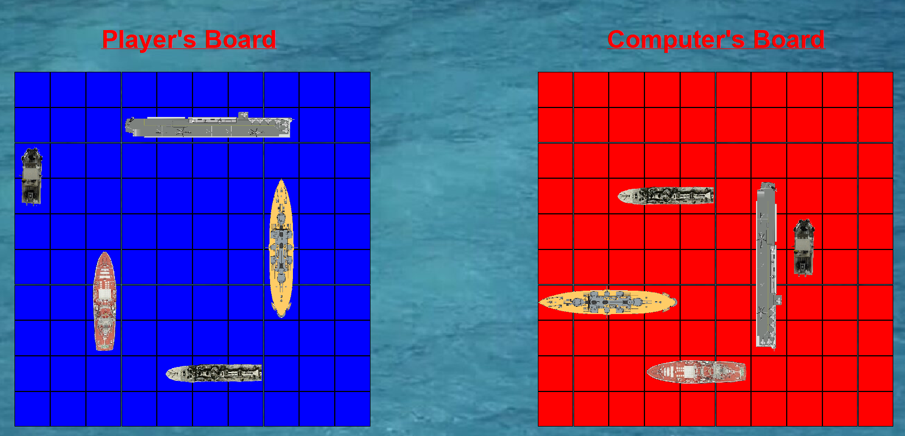

# BattleshipGame

BattleshipGame is a clone of the strategy guessing game under the same name. It is a turn-based game with a player facing against an AI.
  
This game was developed as a final project for the course ICS4U.

# Contents
* [Running The Game](#running-the-game)
* [Things Learned](#things-learned)
* [Preview](#preview)

## Running The Game

This game was created through the Eclipse IDE with Java, in version 2020-03. Therefore, there may be issues with running the game through newer versions.

## Preview
The following is an example of the beginning state of the game after the placement of ships on the player's side:

